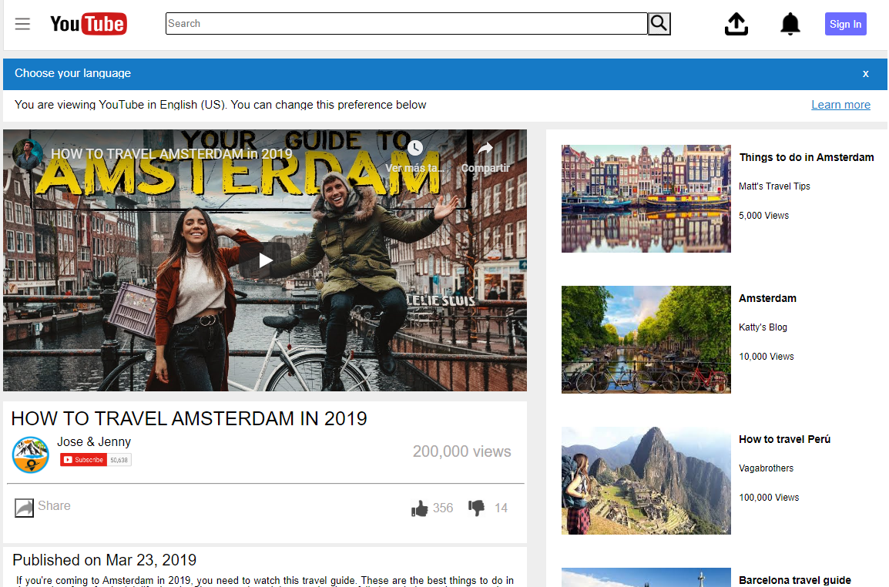

# Youtube Clone Page

> This is our first project for cloning an archived Youtube page as a learning guide .

## Built With

- HTML
- CSS

## Live Demo

[Live Demo Link](https://raw.githack.com/janis-jenny/Youtube-clone-page/master/index.html)

## Authors

👤 **Jenny Cardenas**

- Github: [@janis-jenny](https://github.com/janis-jenny)
- Twitter: [@janis_jenny](https://twitter.com/janis_jenny)
- Linkedin: [linkedin](https://www.linkedin.com/in/jos%C3%A9-pedraza-acevedo/)

👤 **Josè Pedraza**

- Github: [@pastorp3](https://github.com/pastorp3)
- Linkedin: [linkedin](https://www.linkedin.com/in/jonathas-tavares-24b8bba3/)

## 🤝 Contributing

Contributions, issues and feature requests are welcome!

Feel free to check the [issues page](https://github.com/janis-jenny/Youtube-clone-page/issues).

## Show your support

Give a ⭐️ if you like this project!

## 📝 License

This project is [MIT](lic.url) licensed.

Check out the live version <a href="https://raw.githack.com/janis-jenny/Youtube-clone-page/master/index.html">here</a>

